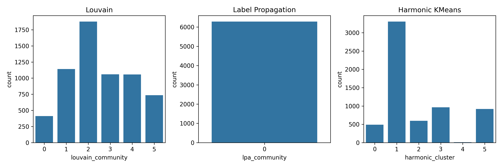

# harmonicClustering

**Harmonic Clustering** is a research project focused on identifying organic listener communities from large-scale music streaming data. Instead of traditional demographic-based clustering, we adopt a **network-science approach** by building **user-user graphs** derived from temporal listening patterns and applying **community detection algorithms** to uncover shared music interests.

> Check out the full implementation in our [main notebook](notebooks/harmonicClustering.ipynb).
---

## Motivation

Streaming platforms accumulate rich temporal listening histories. Rather than grouping users by genres or playlists alone, this project investigates how temporal overlaps in listening behavior can naturally lead to the formation of music communities. We aim to highlight the social dimensions of music discovery by mapping these overlaps into graph structures.

---

## Dataset

We use a filtered version of the **Last.fm 1K users dataset**, which includes detailed listening histories for 1,000 users over several years.

- Extracted listening records for a fixed 3-month duration.
- Grouped listening history into **weekly pseudo-playlists**.
- Sampled a subset of users with high listening activity for focused analysis.

---

## Methodology

### Preprocessing

- Parsed the Last.fm-1K data to extract relevant fields (user, artist, timestamp).
- Created weekly pseudo-playlists per user based on timestamps.
- Filtered tracks to retain only frequent ones and active users.

### Graph Construction

- Computed pairwise user similarity using **Jaccard index** based on shared tracks in overlapping weeks.
- Created a weighted **user-user similarity graph** using NetworkX.

### Community Detection

- Applied multiple community detection algorithms:
  - **Louvain algorithm**
  - **Label Propagation**
  - **Girvan-Newman (edge betweenness)**
- Compared modularity scores and cluster distributions.
  
---
## Visualization

We visualized the user-user network using force-directed layouts. Nodes represent users and edges indicate similarity based on weekly listening overlap. Communities were detected using different algorithms and visualized below.

### Combined Community Graph

### Louvain Community Detection

### Label Propagation (LPA) Clusters

### Harmonic Clustering

### Community Size Comparison

Each visualization highlights unique clustering behavior. Louvain and LPA show differing granularity, while Harmonic Clustering offers smoother transitions. The size comparison plot gives insight into the distribution of cluster memberships.

---

## Goals

- Investigate whether users naturally cluster based on listening time and content overlaps.
- Build an interpretable and reproducible framework for **temporal music graph analysis**.
- Contribute a short research report demonstrating the effectiveness of this methodology.

---

## Sample Output

Example visualizations of the user-user network, along with detected communities and representative artists, will be included in the report and repository.

---

## Project Status

- [x] Data preprocessing and playlist formation  
- [x] User similarity computation  
- [x] Graph construction  
- [x] Community detection  
- [x] Visualization and analysis  
- [x] Report writing  

---

## License

This project is licensed under the [MIT License](LICENSE).

---

## Contributions

Contributions, feedback, and suggestions are welcome. Please fork the repository and open a pull request for any additions or improvements.
